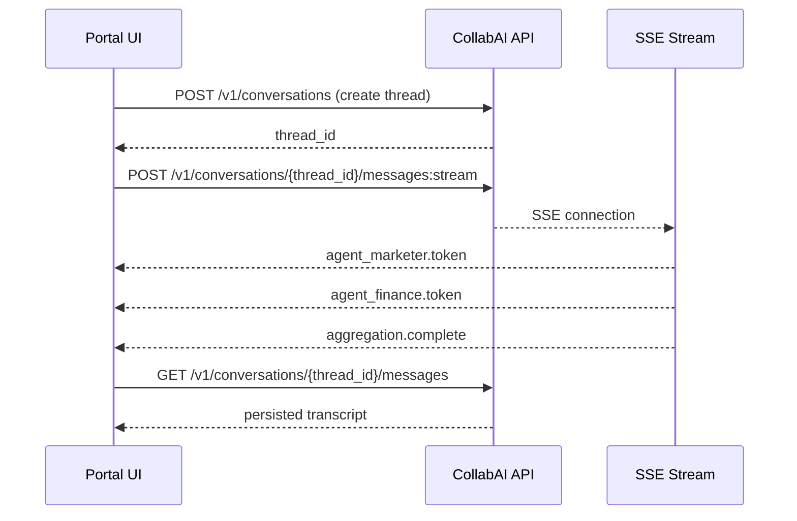

# CollabAI API Codex

## 1. API Overview
### Mission
Deliver a modular, secure, and future-proof RESTful API interface for managing AI assistants, multi-agent systems, users, data, and custom AI behavior that can be deployed in private clouds, corporate servers, and air-gapped environments.

### Architecture Pillars
- **REST-first:** JSON over HTTPS with predictable resource-oriented endpoints. GraphQL layer planned for expressive agent telemetry and aggregation queries.
- **Security-native:** OAuth 2.0-compatible flows, signed JWT access tokens, short-lived refresh tokens, and fine-grained API keys.
- **OpenAPI 3.1 compliant:** Machine-readable schemas fuel SDK generation, mock servers, and contract testing.
- **Edge deployable:** All services function with no external dependencies by default; outbound egress is opt-in per provider or tool.
- **Observability-first:** Correlation IDs, structured logs, and metrics exposed from the outset.

## 2. API Categories

### 🔐 Auth & Identity
- `POST /v1/auth/login` – authenticate via username/password, SSO assertion, or API key exchange.
- `POST /v1/auth/logout` – revoke refresh + access tokens.
- `POST /v1/auth/refresh` – renew access tokens with rotation.
- `GET /v1/auth/keys` – list active API keys; supports per-agent scopes.
- Org isolation enforced via tenant claim in JWT. Roles include `org_admin`, `team_admin`, `agent_builder`, `member`, `viewer`.

### 🧑‍🤖 Agents
- CRUD endpoints under `/v1/agents`.
- Agent payloads include model routing metadata, default prompt templates, persona attributes, allowed tools, and hosting mode overrides.
- Supports draft/published states to gate rollouts.
- Endpoint to clone agents across teams with permission checks.

### 📁 Knowledge Base (KB)
- `/v1/kb` for workspace document repositories.
- Signed upload URL handshake: request upload URL → PUT binary to storage → POST finalize.
- Document chunking, embedding jobs, and reprocessing tracked via `/v1/kb/jobs`.
- Relevance search API provides semantic and keyword query modes.
- Agent-level and team-level KB links enforce access boundaries.

### 🗣️ Conversations
- `/v1/conversations` for thread lifecycle management.
- `/v1/conversations/{id}/messages` accepts user messages, system overrides, tool invocations.
- Streaming responses via Server-Sent Events (`/stream`) and WebSockets (`/socket`).
- Metadata includes user context, channel (Slack, API, UI), and trace IDs.
- Soft delete with retention policies configurable per org.

### 🎮 Agent Tools (Advanced)
- `/v1/tools/registry` enumerates built-in and custom tool adapters.
- `/v1/agents/{id}/tools` manages tool whitelists and token budgets.
- Tool execution policies define rate limits, input filters, and approval workflows.
- Future: `/v1/tools/custom` to upload containerized or serverless tools.

### 👥 Users & Teams
- `/v1/users` for provisioning, invitations, SSO linkages, MFA status.
- `/v1/teams` to group users, assign default agents, and configure collaboration spaces.
- Role inheritance and overrides per team; audit-tracked.
- Directory sync connectors (SCIM) exposed under `/v1/integrations/scim`.

### ⚙️ Settings & Config
- `/v1/settings/models` toggles provider availability (OpenAI, Anthropic, Google, Local LLM).
- `/v1/settings/policies` handles rate limits, conversation retention, export controls.
- `/v1/settings/webhook-targets` manages outbound integration endpoints.
- `/v1/settings/runtime` reveals hosting mode, capabilities, and version information.

### 📡 Webhooks (Planned)
- Event types: `agent.created`, `kb.document.uploaded`, `conversation.message.sent`, `tool.execution.started/finished`.
- Delivery retries with exponential backoff and HMAC signatures.
- Target configuration per org and per team.

### 📊 Metrics & Monitoring
- `/v1/metrics/usage` for token, request, and cost aggregation by agent/user.
- `/v1/metrics/performance` to surface latency, tool execution stats, model availability.
- `/v1/logs/audit` planned for enterprise compliance exports.

## 3. Security Model
- **Zero trust assumption:** treat every network boundary as hostile; require authentication on every request.
- **Token scopes:** Access tokens encode org, team, agent, and KB scopes; least-privilege enforcement at middleware.
- **Signed uploads:** Upload endpoints return pre-signed URLs with time-bound signatures and checksum validation.
- **Rate limiting:** Sliding window per token, per IP, and per org. Burst + sustained policies configurable.
- **API keys:** Non-user integrations obtain keys with explicit scopes; rotation endpoints available.
- **Secrets management:** No plaintext secrets stored; rely on env-specific vault backends.
- **Auditability:** Immutable log trail for key events; storage pluggable (Postgres, Elasticsearch, SIEM connectors).
- **Compliance hooks:** Configurable data residency, retention windows, and encryption-in-transit/en-at-rest guarantees.

## 4. Deployment Mode Awareness
API responses include `hosting_mode` and `model_mode` attributes to communicate capabilities and constraints.

| Mode | Description | API Considerations |
| --- | --- | --- |
| `saas` | Managed CollabAI cloud. Centralized billing, provider proxying, managed storage. | Enable outbound provider calls, managed secret rotation, telemetry export. |
| `self_hosted` | Deployed in customer VPC/on-prem. Customer controls networking and storage. | Default to local model routing, allow bring-your-own provider credentials, disable billing endpoints. |
| `air_gapped` | Fully isolated environment with no external connectivity. | Restrict to internal models, provide offline license verification, queue async tool jobs locally. |

`model_mode` enumerations:
- `external`: Requests proxied to third-party APIs via configured connectors.
- `internal`: Fully local LLM inference (e.g., Mistral, LLaMA) using on-prem runtimes.
- `hybrid`: Agent can choose between internal/external providers based on policy.

## 5. Developer Portal & SDKs
- Auto-generate API reference from OpenAPI spec; publish interactive docs (Redoc/Stoplight).
- Ship Postman collection synchronized with spec changes.
- SDK roadmap:
  - **Python:** First-class client with async support, streaming helpers, and CLI scaffolding.
  - **JavaScript/TypeScript:** Node + browser support, SSE/WebSocket wrappers, tool registration helpers.
  - **Go/Rust (optional):** High-performance integrations for infrastructure teams.
- Provide example apps: Slack bot workflow, Zendesk triage agent, local CLI orchestrator.
- Developer portal features: API key management, usage dashboards, quickstarts, webhook testing sandbox.

## 6. API Lifecycle & Versioning
- Namespace endpoints by version (e.g., `/v1/`).
- Adopt semantic versioning for the spec; mark breaking changes with major version increments.
- Publish change logs and migration guides.
- Feature flags deliver experimental capabilities; opt-in via `X-CollabAI-Preview` header.
- Deprecation headers indicate sunset timelines; provide compatibility matrix (CollabAI release vs. API versions).
- Automated contract tests to ensure backwards compatibility.

## 7. Codex-Grade API Usage Examples

### Create a Custom Agent
```http
POST /v1/agents
Authorization: Bearer <token>
Content-Type: application/json

{
  "name": "Marketing Strategist AI",
  "model": "gpt-4",
  "role": "Strategist",
  "personality": "Bold and data-driven",
  "tools": ["web_search", "kb_access"],
  "default_prompt": "Act as a CMO assistant and suggest marketing plans.",
  "hosting_mode": "self_hosted",
  "model_mode": "hybrid"
}
```

### Upload KB Document (Signed URL Flow)
```http
POST /v1/kb/upload-url
Authorization: Bearer <token>
Content-Type: application/json

{
  "file_name": "Q4_Market_Report.pdf",
  "agent_id": "agent_123",
  "checksum": "b1946ac92492d2347c6235b4d2611184"
}
```
Response:
```json
{
  "upload_url": "https://storage.internal/upload/abc123",
  "fields": {"key": "kb/agent_123/Q4_Market_Report.pdf"},
  "expires_in": 900
}
```

### Send Message to Agent (Streamed Response)
```http
POST /v1/conversations/thread_456/messages:stream
Authorization: Bearer <token>
Content-Type: application/json
Accept: text/event-stream

{
  "agent_id": "agent_123",
  "message": "Give me 3 insights from the Q4 report.",
  "user_id": "user_789"
}
```

### Multi-Agent Workspace Chat from a Portal
1. **Discover available assistants for the signed-in user:**
   ```http
   GET /v1/agents?team_id=team_finance&capability=chat-completion
   Authorization: Bearer <token>
   ```
   Example response:
   ```json
   {
     "items": [
       {
         "id": "agent_marketer",
         "name": "Marketing Strategist AI",
         "model": "gpt-4",
         "hosting_mode": "self_hosted",
         "model_mode": "hybrid",
         "tools": ["kb_access"],
         "portal_shortcut": "#marketing"
       },
       {
         "id": "agent_finance",
         "name": "Finance Analyst AI",
         "model": "mistral-large",
         "hosting_mode": "air_gapped",
         "model_mode": "internal",
         "tools": ["calculator", "kb_access"],
         "portal_shortcut": "#finance"
       }
     ]
   }
   ```

2. **Create or reuse a multi-agent thread anchored to the user’s portal channel:**
   ```http
   POST /v1/conversations
   Authorization: Bearer <token>
   Content-Type: application/json

   {
     "title": "Quarterly Strategy Room",
     "participant_agents": ["agent_marketer", "agent_finance"],
     "origin": {
       "channel": "portal",
       "channel_id": "room_q4_strategy"
     }
   }
   ```
   Response:
   ```json
   {
     "id": "thread_multi_001",
     "participant_agents": ["agent_marketer", "agent_finance"],
     "created_at": "2024-05-09T18:21:33Z",
     "hosting_mode": "self_hosted"
   }
   ```

3. **Post a message on behalf of the portal user and stream combined agent responses:**
   ```http
   POST /v1/conversations/thread_multi_001/messages:stream
   Authorization: Bearer <token>
   Content-Type: application/json
   Accept: text/event-stream

   {
     "user_id": "user_portal_17",
     "message": "Summarize marketing and finance risks for Q4.",
     "dispatch": {
       "mode": "parallel",
       "agents": [
         {"id": "agent_marketer"},
         {"id": "agent_finance"}
       ]
     }
   }
   ```
   SSE payloads are interleaved per agent:
   ```text
   event: agent_marketer.token
   data: "Top marketing risks include..."

   event: agent_finance.token
   data: "Primary finance exposure stems from..."

   event: aggregation.complete
   data: {
     "summary": "Combined analysis ready",
     "next_actions": ["Review budget model", "Schedule executive sync"]
   }
   ```

4. **Persist the transcript back to the portal UI:** fetch the latest combined view.
   ```http
   GET /v1/conversations/thread_multi_001/messages?include=agent_summaries
   Authorization: Bearer <token>
   ```

5. **Push notifications to other clients:** use the conversation webhook or polling endpoint to broadcast updates to Slack, email, or a custom UI.

### Assistant Thread Lifecycle from a Client Application
The following illustrates how a portal front end can drive an entire assistant workflow using the REST API and Server-Sent Events.



#### TypeScript portal snippet
```ts
import { fetchEventSource } from "@microsoft/fetch-event-source";

const accessToken = await authStore.getAccessToken();

const thread = await fetch("/v1/conversations", {
  method: "POST",
  headers: {
    "Authorization": `Bearer ${accessToken}`,
    "Content-Type": "application/json",
  },
  body: JSON.stringify({
    title: "Quarterly Strategy Room",
    participant_agents: ["agent_marketer", "agent_finance"],
    origin: { channel: "portal", channel_id: "room_q4_strategy" }
  }),
}).then(res => res.json());

await fetchEventSource(`/v1/conversations/${thread.id}/messages:stream`, {
  method: "POST",
  headers: {
    "Authorization": `Bearer ${accessToken}`,
    "Content-Type": "application/json",
  },
  body: JSON.stringify({
    user_id: currentUser.id,
    message: prompt,
    dispatch: {
      mode: "parallel",
      agents: [{ id: "agent_marketer" }, { id: "agent_finance" }]
    }
  }),
  onmessage(ev) {
    const { event, data } = ev;
    renderAgentEvent(event ?? "token", data);
  }
});

const transcript = await fetch(`/v1/conversations/${thread.id}/messages?include=agent_summaries`, {
  headers: { "Authorization": `Bearer ${accessToken}` }
}).then(res => res.json());

renderTranscript(transcript.items);
```

#### Persisting structured outcomes back to a workflow engine
```http
POST /v1/conversations/thread_multi_001/outcomes
Authorization: Bearer <token>
Content-Type: application/json

{
  "summary": "Combined marketing + finance perspective on Q4 risk landscape.",
  "tags": ["q4", "risk", "cross-functional"],
  "follow_up_tasks": [
    {
      "title": "Update revenue sensitivity model",
      "assignee": "agent_finance",
      "due_at": "2024-05-15"
    }
  ],
  "sync_targets": ["slack://channel/executive-briefings", "notion://page/strategy-q4"]
}
```

### Query Usage Metrics
```http
GET /v1/metrics/usage?agent_id=agent_123&window=7d
Authorization: Bearer <token>
```

## 8. Internal Codex Guidelines
- Maintain a single source of truth via OpenAPI 3.1 schemas; generate server stubs and clients.
- Provider-agnostic design: models referenced by capability tags (`chat-completion`, `image-generation`) rather than vendor IDs.
- Enforce permission scopes at routing layer; endpoints never return resources outside caller scope.
- Agent autonomy guardrails: require explicit tool whitelists, context size limits, and policy enforcement for KB access.
- Implement structured logging with sensitive-field redaction; provide correlation IDs for distributed tracing.

## 9. Roadmap-Aligned API Features
- **Agent marketplace:** `/v1/agents/market` for sharing and installing agent templates across tenants.
- **Plugin system:** `/v1/agent-tools/custom` to register externally hosted tools with schema validation.
- **Prompt library:** `/v1/prompts` exposing reusable prompt patterns and governance controls.
- **Analytics:** `/v1/metrics/agents` delivering comparative agent performance dashboards.
- **Audit logs:** `/v1/audit` to export signed event ledgers.
- **Fine-tuned models:** `/v1/models/custom/train` for managing organization-specific fine-tunes and evaluation results.
- **Policy automation:** `/v1/policies` to encode guardrails, approvals, and escalation workflows.

## 10. Execution Model & Checklist
Treat the API as mission-critical infrastructure.

### Immediate Actions
- [ ] Finalize OpenAPI 3.1 spec covering all v1 endpoints.
- [ ] Stand up automated contract tests and mock server (Prism/Stoplight).
- [ ] Implement auth, rate limiting, and quota enforcement middleware.
- [ ] Integrate observability stack (metrics, logs, tracing) before GA.
- [ ] Prepare SDK release pipelines with CI validation against mock server.
- [ ] Launch developer portal with docs, guides, and interactive consoles pre-1.0.

### Operational Practices
- Enforce infrastructure-as-code for deployment configs.
- Run security threat modeling per release; maintain SDL checklists.
- Provide migration tooling for deprecated endpoints.
- Maintain public roadmap and changelog cadence.

## 11. Appendix: OpenAPI Starter Kit
- Repository layout proposal:
  - `/openapi/collab-ai.v1.yaml` – canonical spec.
  - `/openapi/examples/` – request/response fixtures.
  - `/sdk/python/`, `/sdk/js/` – generated clients with hand-written enhancements.
  - `/samples/` – end-to-end automation examples (Slack bot, knowledge ingestion pipeline).
  - `/docs/` – markdown-based guides with diagrams.
  - `/tests/contract/` – Postman or Dredd-style suites against mock server.
- Continuous validation: Spec linting (Spectral), schema testing, and backwards-compatibility gates.

> **CollabAI’s API is a control surface.** Guard it, evolve it, and ensure every endpoint empowers developers to build sovereign AI systems without sacrificing security or scale.
